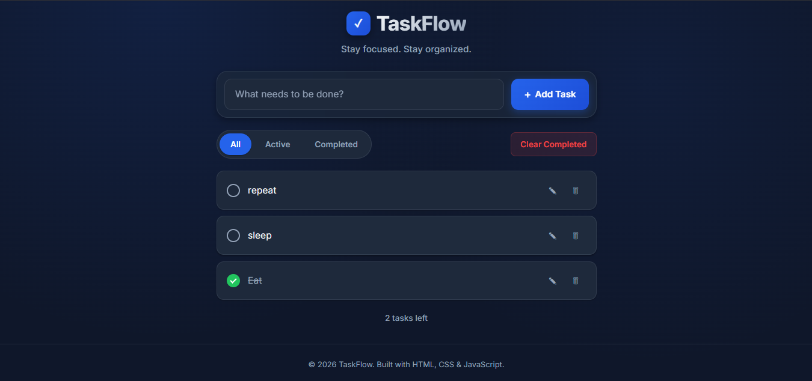
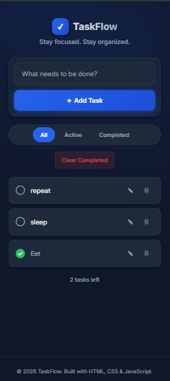

# TaskFlow — Modern To-Do List App

A polished, production-quality to-do list application built entirely with **HTML5, CSS3, and Vanilla JavaScript** — no frameworks, no libraries, no build tools. Inspired by the clean, dark aesthetics of GitHub, Linear, Vercel, and Notion.



---

## ✨ Features

- ✅ Full CRUD support — create, read, update, and delete tasks
- ✅ Toggle task completion with a custom animated checkbox
- ✅ Inline task editing via prompt dialog
- ✅ Filter tasks by **All**, **Active**, or **Completed**
- ✅ Live task counter ("X tasks left")
- ✅ Clear all completed tasks in one click
- ✅ Automatic persistence via `localStorage` — tasks survive page reloads
- ✅ Elegant empty state when no tasks match the current filter
- ✅ Keyboard support — press **Enter** to add a task
- ✅ Input validation — prevents empty or whitespace-only tasks
- ✅ Single delegated event listener for all task actions (efficient & scalable)
- ✅ Fully responsive, mobile-first layout
- ✅ Glassmorphism effects, smooth transitions, and hover micro-interactions
- ✅ Accessible markup — semantic HTML5, ARIA attributes, skip link, visually-hidden labels

---

## 📁 Folder Structure

```text
todo-app/
│── index.html
│── README.md
│
└── assets
    ├── css
    │   └── style.css
    └── js
        └── app.js
```

---

## 🛠️ Technologies Used

| Technology | Purpose |
|---|---|
| HTML5 | Semantic structure & accessibility |
| CSS3 | Styling, layout (Flexbox & Grid), animations, responsiveness |
| Vanilla JavaScript (ES6+) | Application logic, state management, DOM manipulation |
| Web Storage API | Persisting tasks in `localStorage` |
| Google Fonts (Inter) | Modern typography |

No frameworks. No libraries. No build step. Just open and run.

---

## 🚀 How to Run

1. **Clone or download** this repository.
2. Navigate into the project folder:
```bash
   cd todo-app
```
3. Open `index.html` directly in your browser:
   - Double-click the file, **or**
   - Right-click → "Open with" → your preferred browser, **or**
   - Serve it locally with a simple static server, e.g.:
```bash
     npx serve .
```
     then visit `http://localhost:3000`

No installation, dependencies, or build tools required.

---

## 📸 Screenshots

Desktop View


Mobile View


---

## 👤 Author

**Rohith**

---

## 📄 License

This project was created for educational and internship purposes.